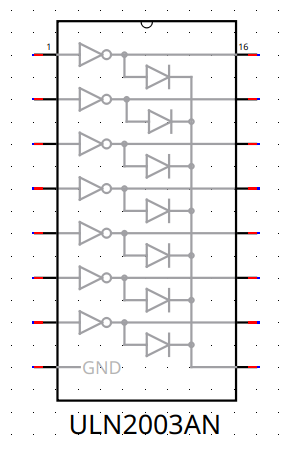
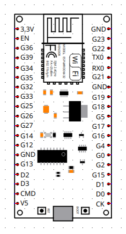
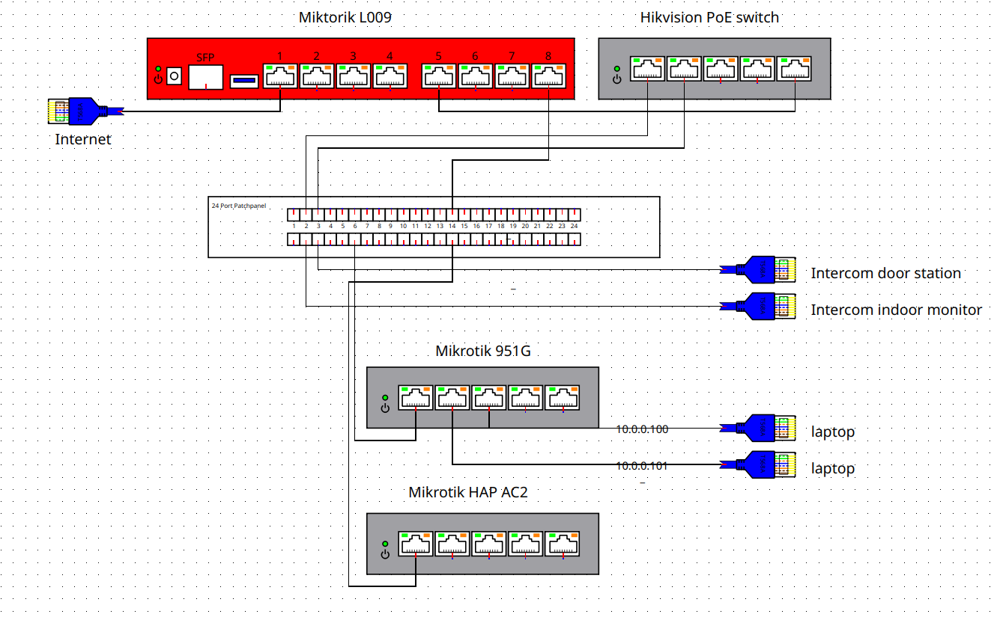

# qelectrotech-elements

My qelectrotech elements library

# Elements

## Mikrotik L009

## 24 port patchpanel

Fixed port numbering positions. Original author: [qelectrotech-elements/netzwerk/24portpatchpanel.elmt at master · ReichardtIT/qelectrotech-elements · GitHub](https://github.com/ReichardtIT/qelectrotech-elements/blob/master/netzwerk/24portpatchpanel.elmt)

## L7805

## ULN2003AN

## Box connector

A simple element with two terminals from both sides, allowing for drawing connection diagrams in junction boxes.

## ESP WROOM 32 DevKit

Based on ESP8266 nodemcu v3 from qelectrotech elements library https://qelectrotech.org/forum/viewtopic.php?pid=15569#p15569

# Examples of use

## networking

## box connector

